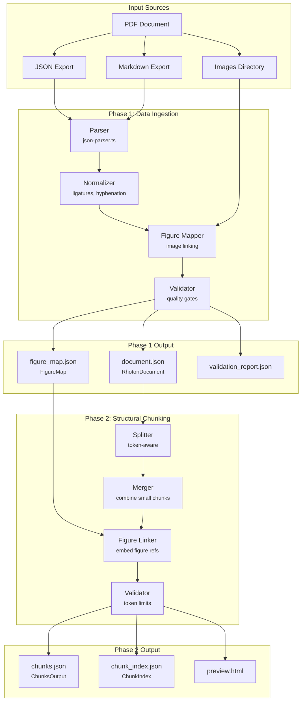
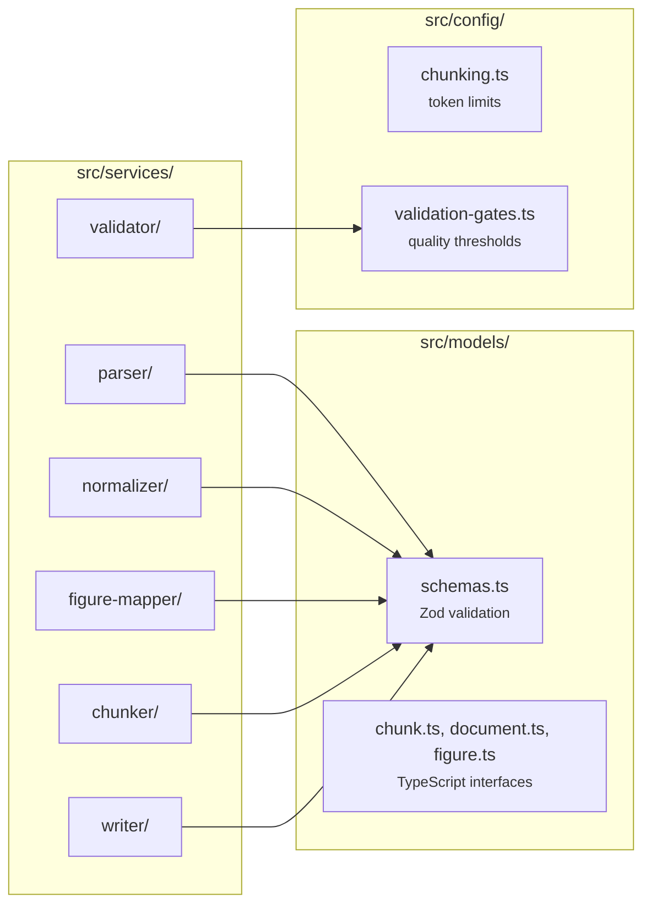
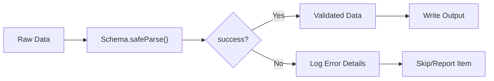

# III-V Pipeline Architecture

## Data Flow Diagram

## Service Layer

## Validation Flow

## Token Limits

| Stage | Constant | Value | Purpose |
|-------|----------|-------|---------|
| Split | `MAX_TOKENS` | 512 | Target chunk size |
| Merge | `MIN_TOKENS` | 80 | Merge threshold |
| Validate | `HARD_MAX_TOKENS` | 600 | Schema maximum |
